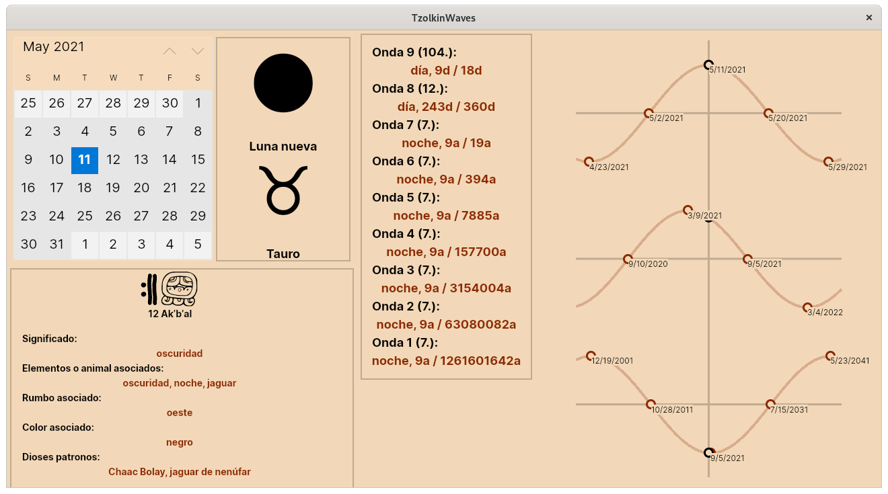
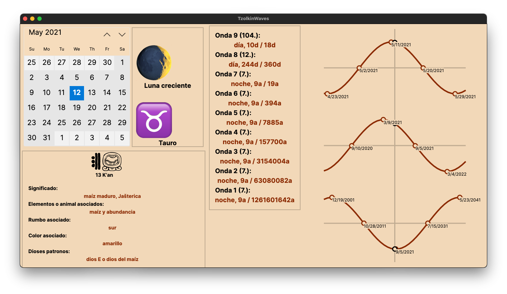
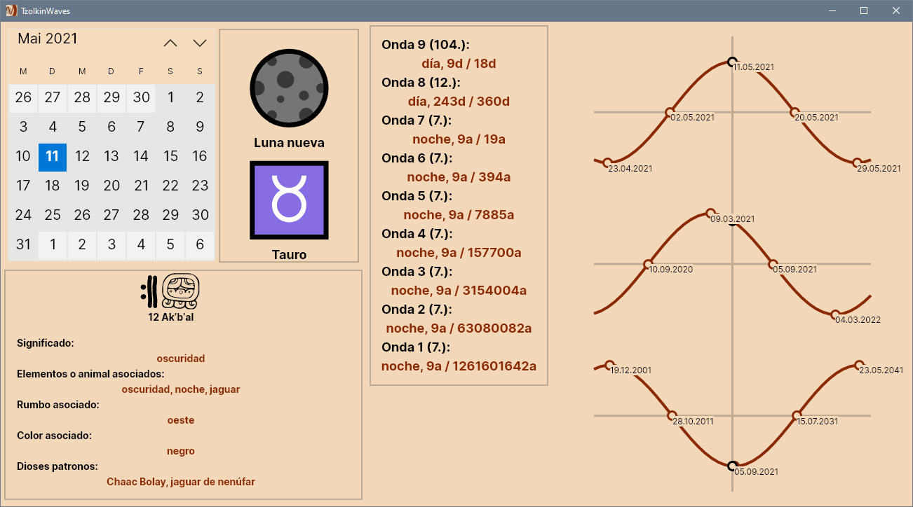

> [!WARNING]
> This repository has been moved to [Codeberg: TzolkinWaves](https://codeberg.org/Release-Candidate/TzolkinWaves)

#  TzolkinWaves <!-- omit in toc -->

This F# cross platform - Linux, Mac OS X and Windows - program that uses Avalonia.FuncUI as the MVU (Elm style) API wrapper for the Avalonia .Net GUI Toolkit. It uses the NuGet packages Tzolkin, NineWaves and LunaZodiaco to display the Maya Tzolkʼin date, Calleman's nine Maya waves and the moon phase and moon zodiac of a given date.

Full documentation can be found at [Read the Docs](https://TzolkinWaves.readthedocs.io/en/latest/)

Uses [Avalonia FuncUI](https://github.com/fsprojects/Avalonia.FuncUI) as MVU (Elm-style) API to the [Avalonia](https://avaloniaui.net/) cross platform GUI toolkit.

Uses the NuGet packages [Tzolkin](https://github.com/Release-Candidate/Tzolkin) - [NuGet Package Tzolkin](https://www.nuget.org/packages/Tzolkin/), [NineWaves](https://github.com/Release-Candidate/NineWaves) - [NuGet Package NineWaves](https://www.nuget.org/packages/NineWaves/) and [LunaZodiaco](https://github.com/Release-Candidate/LunaZodiaco) - [NuGet Package LunaZodiaco](https://www.nuget.org/packages/LunaZodiaco/).

## Table of Content <!-- omit in toc -->

- [Links](#links)
  - [Own Libraries used](#own-libraries-used)
- [Download](#download)
- [Installation and Usage](#installation-and-usage)
- [Contributing](#contributing)
- [License](#license)
- [Privacy Policy](#privacy-policy)
- [Badges](#badges)
  - [Code coverage](#code-coverage)
  - [GitHub Actions/Workflows](#github-actionsworkflows)

## Links

(Functional) programming language: [F#](https://fsharp.org/)

Cross platform framework (yes, really!): [.Net](https://dotnet.microsoft.com/download)

MVU - [Elm](https://elm-lang.org/) style - GUI Wrapper: [Avalonia FuncUI](https://github.com/fsprojects/Avalonia.FuncUI)

Cross platform GUI Toolkit: [Avalonia](https://avaloniaui.net/)

### Own Libraries used

To convert and calculate with Maya Tzolkʼin dates: [Tzolkin](https://github.com/Release-Candidate/Tzolkin) [NuGet Package Tzolkin](https://www.nuget.org/packages/Tzolkin/)

To display information about and graphs of Carl Johan Calleman's nine Maya waves: [NineWaves](https://github.com/Release-Candidate/NineWaves) [NuGet Package NineWaves](https://www.nuget.org/packages/NineWaves/)

To display the moon phase and lunar zodiac for a given date: [LunaZodiaco](https://github.com/Release-Candidate/LunaZodiaco) [NuGet Package LunaZodiaco](https://www.nuget.org/packages/LunaZodiaco/)

## Download

List of changes: [CHANGELOG.md](https://github.com/Release-Candidate/TzolkinWaves/blob/main/CHANGELOG.md)

[Link to the latest release](https://github.com/Release-Candidate/TzolkinWaves/releases/latest)

## Installation and Usage

Download the latest release for your OS: [Release at GitHub](https://github.com/Release-Candidate/TzolkinWaves/releases/latest), copy the executable somewhere on your computer and run it.

## Contributing

Any help is welcome!

If you encounter a problem using TzolkinWaves, a task it not as easy as you'd like it to be or you'd like something added to it: open an issue at GitHub, see section [Report Issues](#report-issues-bugs-and-feature-requests).

See page [Contributing](https://TzolkinWaves.readthedocs.io/en/latest/contributing/) at Read the Docs for a detailed description.

## License

All content of TzolkinWaves is licensed under the MIT license, see file [LICENSE](https://github.com/Release-Candidate/TzolkinWaves/blob/main/LICENSE).

## Privacy Policy

TzolkinWaves does not collect or share any personal information, it does not contain any ads, trackers or in-app-payments. See: [Privacy Policy](https://github.com/Release-Candidate/TzolkinWaves/blob/main/privacy_policy.md)

